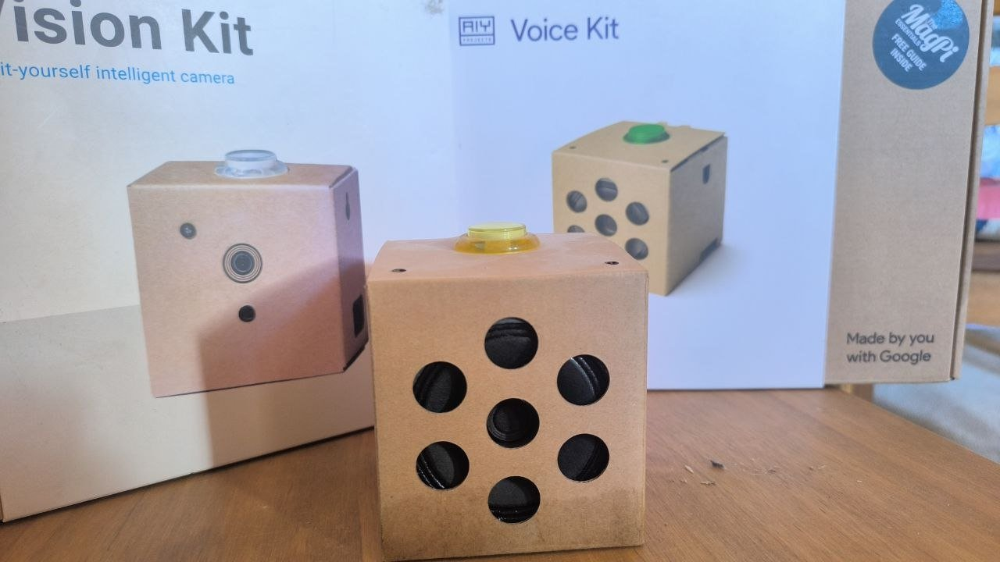
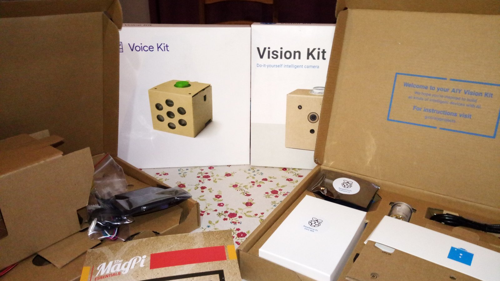
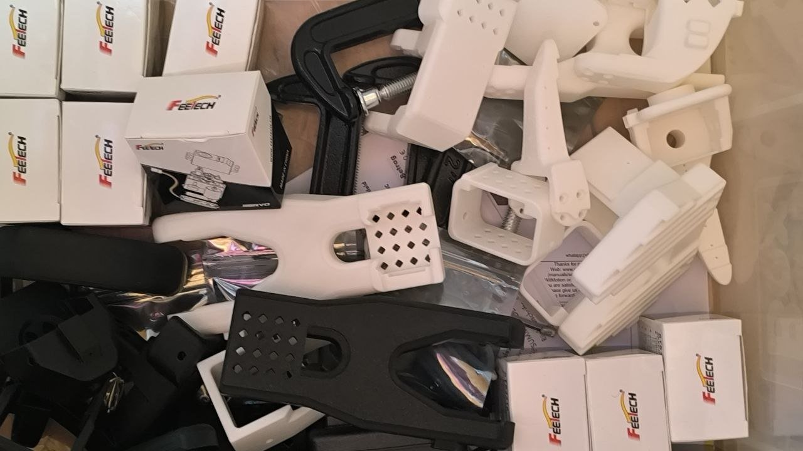
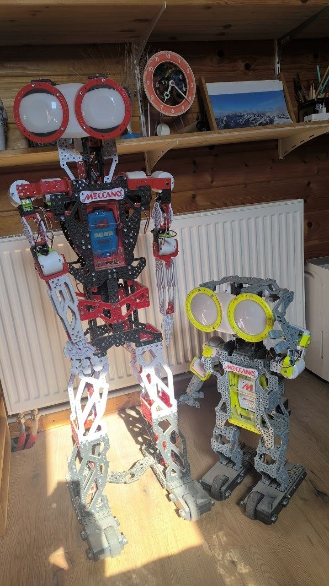
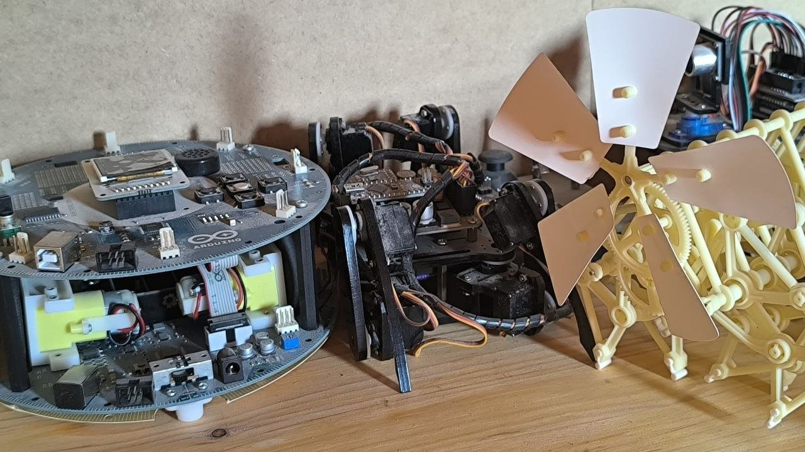
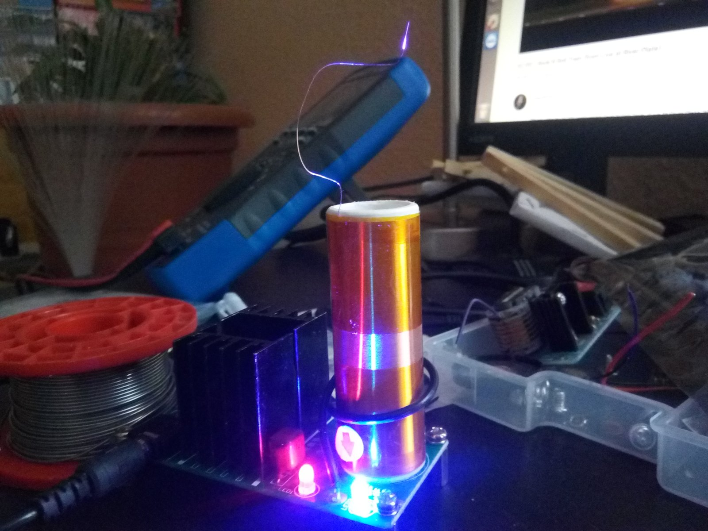
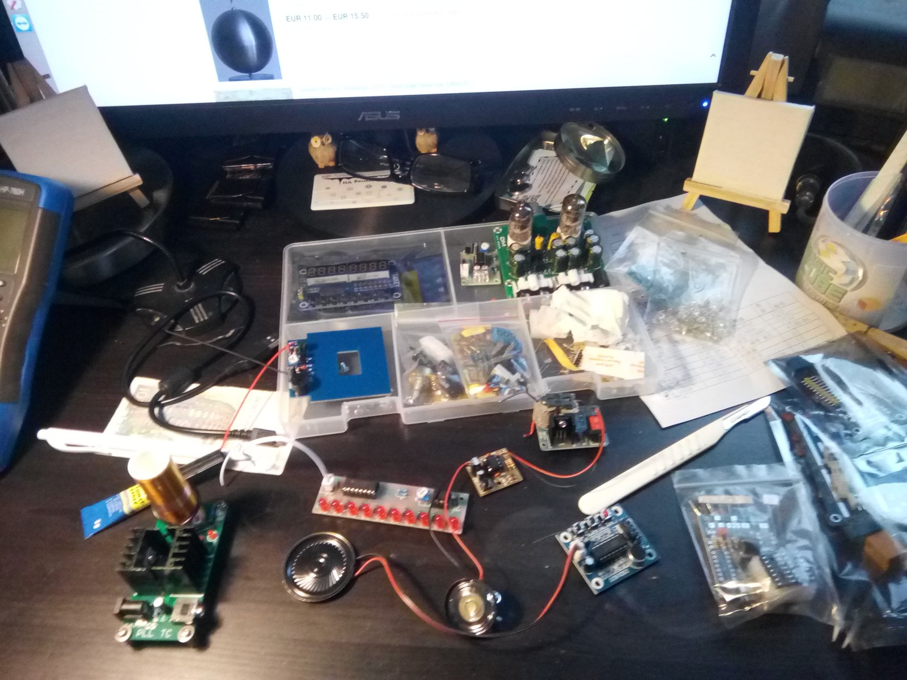
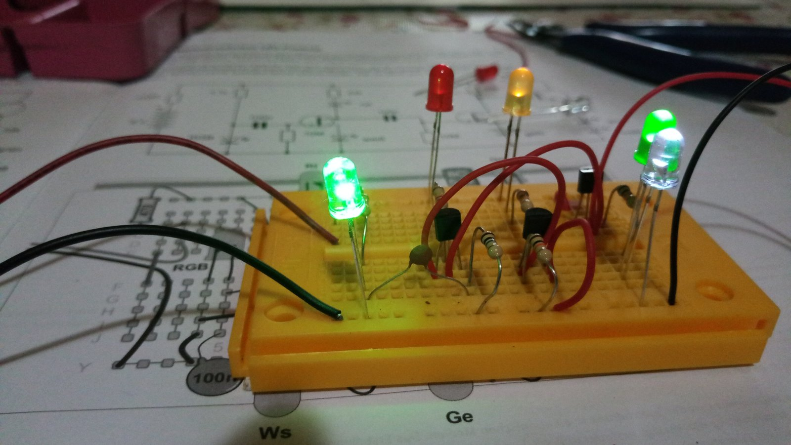
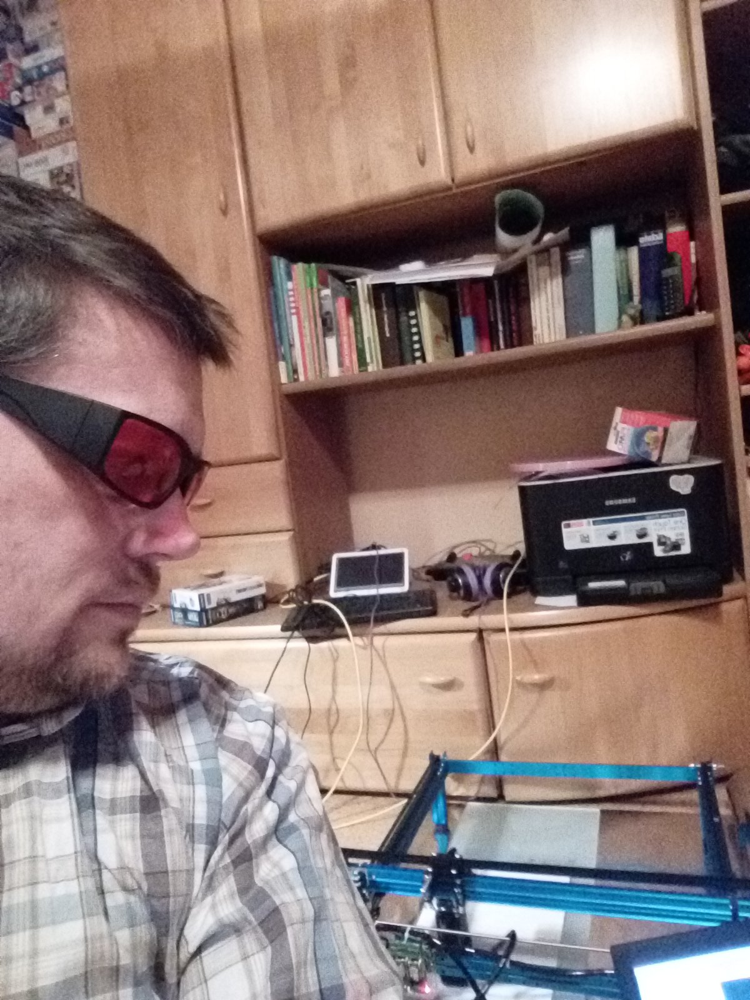

# Iliya Angelov Radulov

### Materials physicist, currently learning to automate his own old job.

---

## 👋 About

25+ years in physics and materials science — synthesis, characterization, and experimental automation, mostly done the long way, by hand. Since 2026 I've been consulting and deliberately re-training in Python and data science, not as a career pivot, but as tool acquisition for the actual goal: closing the loop between materials prediction, synthesis, and characterization.

Based in Bad König, Germany.

## 🕰️ A (very) brief tech timeline

Some context for why "learning to code" at this stage of a career is a feature, not a late start:

- **School:** Fortran 77, on a Pravetz 386 — 2 MB RAM, 5.25″ floppy disks
- **Until 1999:** Windows 3.11 — then switched to Ubuntu, and never really looked back (still keep half an eye on Windows/macOS out of professional necessity — currently also conscripted into Mac life)
- **University:** Fortran gave way to Delphi, then LabVIEW for experiment automation
- **Along the way:** small Arduino projects, none of them big
- **With my kids, over the years:** a lot of joyfully unserious builds with Makeblock, littleBits, BBC micro:bit, Meccano
- **Now:** Python & data science, aimed at finally getting the bigger idea working

The throughline hasn't changed in 40 years: learn whatever tool is available, use it to automate the last experiment. Currently working on the next one.

## 🧰 The workshop: hardware waiting for a brain

Not just talk — some of the actual starting material is already sitting here:

<table>
<tr>
<td width="50%">

 <b>Google AIY Voice Kit & Vision Kit</b> — bought a while ago, built, mostly unused since. Cardboard cases around a Pi Zero, a mic array, and a camera. Originally an impulse buy; now the obvious starting point for Arduino/Raspberry-Pi + ML projects.
</td>
<td width="50%">

 Both kits unboxed — Pi Zero W, camera module, the works. Still in good shape, just waiting for a project.
</td>
</tr>
<tr>
<td width="50%">

 <b><a href="https://www.youtube.com/watch?v=70GuJf2jbYk">LeRobot SO-ARM101</a></b> — recently bought, currently living in a parts bin. This is the actual physical target for closing the loop between ML and manipulation.
</td>
<td width="50%">

 <b>Meccano Meccanoid robots</b>, built together with my kids over the years — mechanically capable, electronically simple, a lot of fun.
</td>
</tr>
<tr>
<td width="50%">

 Small Arduino-based builds from over the years — a rolling robot base, a ball-balancing mechanism, a windmill drive. Nothing that shipped, but the itch was always there.
</td>
<td width="50%">

 Because sometimes the point of electronics is just watching a spark jump.
</td>
</tr>
<tr>
<td width="50%">

 The usual state of the desk mid-project: boards, bags of components, a soldering iron never far away.
</td>
<td width="50%">

 Breadboard basics — still where every new idea gets tested first.
</td>
</tr>
</table>

 The actual workbench. CNC frame in the foreground, decades of accumulated projects on the shelves behind.

## 🔬 Then: the physics

- **PhD, Condensed Matter Physics** — Institute of Solid State Physics, Bulgarian Academy of Sciences (magnetic properties of rare earth manganites)
- **MSc, Radiophysics and Electronics** — Sofia University "St. Kliment Ohridski"
- **Marie Curie Postdoctoral Fellowship** — IESL-FORTH, strongly correlated electronic systems
- **Postdoctoral Researcher** — TU Darmstadt, Functional Materials Lab
- **Senior Researcher** — Fraunhofer IWKS, functional materials R&D
- Research areas: magnetocaloric materials, magnetic/multiferroic oxides, structure–property relationships, lab-to-pilot-scale upscaling

## 📊 Now: data engineering & analytics (the transition period)

Real, current, shipped work — see the [portfolio](https://iliya-radulov.github.io/) for details:

| Project | What it does |
|---|---|
| [GoExplore Data Stack](https://iliya-radulov.github.io/projects/metabase/goexplore-data-stack.html) | Local analytics stack replacing Google Sheets & BigQuery — GDPR-compliant, vendor-free |
| [KNIME → BigQuery](https://iliya-radulov.github.io/projects/KNIME/knime-bigquery-portfolio.html) | Visual analytics pipeline over GCP, JDBC, live SQL |
| [Sales Prediction (Random Forest)](https://iliya-radulov.github.io/projects/KNIME/knime-ml-portfolio.html) | Regression pipeline on live BigQuery data |
| [Market Revenue Prediction](https://iliya-radulov.github.io/projects/market_prediction/market-revenue-prediction.html) | Econometric analysis, OLS with HAC-corrected errors |

**Toolbox:** Linux · Python · SQL · KNIME · Docker · Git · LaTeX

This is training, not the destination — the aim is to bring modern data science and AI into physics workflows, not to run analytics dashboards forever.

## 🎯 Where this is going

The actual goal — stated plainly as a goal, not a shipped product:

- ML-assisted prediction of materials synthesis routes
- Automated / assisted characterization (starting where I already know the physics)
- Eventually, a closed loop between prediction, synthesis, and characterization

| Current state | Target |
|---|---|
| Synthesis planned by hand, from experience | ML-assisted synthesis prediction |
| Phase identification by eye | Assisted / automated pattern recognition |
| Arduino tinkering with the kids | Real experiment automation |
| Sticky notes and pipettes | Closed-loop, data-driven lab workflow |

No robotic arm yet. No papers on it yet. Just a clear direction and a person who has spent 40 years learning whatever tool was available at the time.

## 📫 Reach me

[Portfolio](https://iliya-radulov.github.io/) · [LinkedIn](https://www.linkedin.com/in/iliyaradulov/) · [ORCID](https://orcid.org/0000-0001-8943-5083) · [Scopus](https://www.scopus.com/authid/detail.uri?authorId=56022860600) · iliyaradulov@gmail.com
